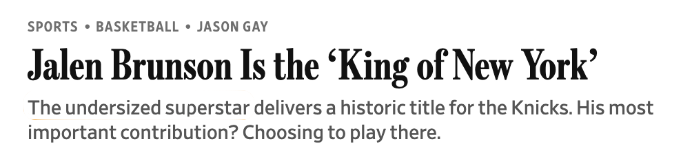
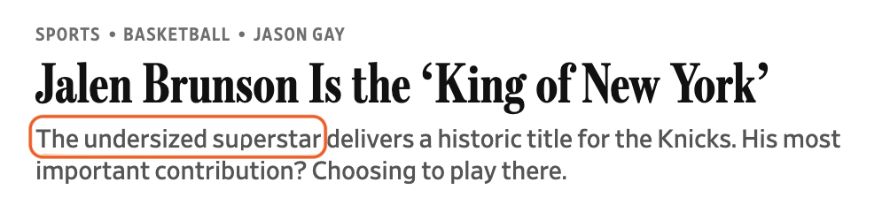

:::{#intro .column-page}
Jalen Brunson was the engine of the Knicks' historic 2026 championship run, earning NBA Finals MVP honors while leading the postseason in total scoring with 28.4 points per game. In the decisive Game 5, he score 45 points in total and scoring 13 straight in the fourth quarter to rally the Knicks from a double-digit deficit and secure their first title in 53 years.
:::

```{r setup}
library(tidyverse)
library(ggtext)
library(here)
library(haven)
library(Hmisc)

```

```{r theme}

custom_theme <- function() {
    theme_minimal(
        base_family = "Instrument Sans", 
        base_size = 14,
        paper = "white", ink = "grey30") +
        theme(
            plot.title = element_text(color = "black"),
            panel.grid.major.x = element_blank(),
            panel.grid.major.y = element_line(),
            panel.grid.minor = element_blank(),
            axis.line.x = element_line(linewidth = 0.25, color = "grey20")
        )
}

theme_set(custom_theme())

```


```{r load-nba-player-bio, cache=TRUE}

#' Source: https://www.nba.com/stats/players/bio?SeasonType=Regular+Season

df_nba_bio <- read_tsv(here("data", "nba-bio-202526.tsv"))

feet_to_cm <- 30.48
inch_to_cm <- 2.54

df_nba_height <- df_nba_bio |> 
    transmute(
        Player, Team, 
        height_in = Height,
        height_cm = round(
            as.numeric(str_extract(Height, "^\\d")) * feet_to_cm +
            as.numeric(str_extract(Height, "\\d{1,2}$")) * inch_to_cm
        )
    )

```


```{r brunson-height}

brunson_height <- df_nba_height |> 
    filter(Player == "Jalen Brunson") |> 
    pull(height_cm)

smaller_than_brunson <- df_nba_height |> 
    filter(height_cm < brunson_height) |>
    nrow()
taller_than_brunson <- df_nba_height |> 
    filter(height_cm > brunson_height) |>
    nrow()
same_size_as_brunson <- df_nba_height |> 
    filter(height_cm == brunson_height) |>
    nrow()

```


```{r}

#' Source: NHANES 2021-23 Examination Data
#' https://wwwn.cdc.gov/nchs/nhanes/search/datapage.aspx?Component=Examination&Cycle=2021-2023
#' https://wwwn.cdc.gov/nchs/nhanes/search/datapage.aspx?Component=Demographics&Cycle=2021-2023

# Examination data
url_cdc_data_height <- "https://wwwn.cdc.gov/Nchs/Data/Nhanes/Public/2021/DataFiles/BMX_L.xpt"
df_cdc_height <- haven::read_xpt(url_cdc_data_height)

# Demographics - keep only adult, male respondents
url_cdc_data_demo <- "https://wwwn.cdc.gov/Nchs/Data/Nhanes/Public/2021/DataFiles/DEMO_L.xpt"
df_cdc_demo <- haven::read_xpt(url_cdc_data_demo)
df_cdc_demo_male <- df_cdc_demo |> 
    filter(RIAGENDR == 1, RIDAGEYR >= 18) |> # 1 = male 
    select(SEQN, RIAGENDR, WTMEC2YR)


df_cdc_height_male <- df_cdc_height |> 
    inner_join(df_cdc_demo_male, by = join_by(SEQN)) |> 
    # keep valid measurements
    filter(!is.na(BMXHT), is.na(BMIHT)) |> 
    select(SEQN, RIAGENDR, WTMEC2YR, BMXHT) |> 
    arrange(-BMXHT)

mean_height_cm <- weighted.mean(df_cdc_height_male$BMXHT, w = df_cdc_height_male$WTMEC2YR)
mean_height_ft <- mean(df_cdc_height_male$BMXHT) %/% feet_to_cm
mean_height_rest_in <- round(mean(df_cdc_height_male$BMXHT) %% feet_to_cm / inch_to_cm)
sd_height_cm <- sqrt(Hmisc::wtd.var(df_cdc_height_male$BMXHT, w = df_cdc_height_male$WTMEC2YR))


# Generate distribution
df_men_dist <- data.frame(
    x = seq(
        mean_height_cm - 4 * sd_height_cm, 
        mean_height_cm + 4 * sd_height_cm,
        length.out = 100)
    )
df_men_dist$y <- dnorm(df_men_dist$x, mean = mean_height_cm, sd = sd_height_cm)

# Split distribution at Brunson's height
df_men_dist_left <- df_men_dist |> filter(x <= brunson_height)
df_men_dist_right <- df_men_dist |> filter(x >= brunson_height)

# Add Brunson's height if not exactly part of the 1000 generated values
y_at_cut <- approx(df_men_dist$x, df_men_dist$y, xout = brunson_height)$y
df_at_cut <- data.frame(x = brunson_height, y = y_at_cut)
df_men_dist_left <- bind_rows(df_men_dist_left, df_at_cut)
df_men_dist_right <- bind_rows(df_at_cut, df_men_dist_right)

```


```{r echo=FALSE, include=FALSE}

# message(sprintf("%d ft %d in", mean_height_ft, mean_height_rest_in))

min(df_cdc_height_male$BMXHT)
quantile(df_cdc_height_male$BMXHT, probs = c(0.05, 0.5, 0.63, 0.8, 0.9, 0.95, 0.96, 0.97, 0.99))

sum(df_cdc_height_male$WTMEC2YR)
```


:::{.cr-section}


```{r}
min_histo_height <- pmin(min(df_nba_height$height_cm), min(df_cdc_height_male$BMXHT))
max_histo_height <- pmax(max(df_nba_height$height_cm), max(df_cdc_height_male$BMXHT))

alpha <- 0.5
peak_y <- 0.055

p_base <- ggplot() +
    scale_y_continuous(
        labels = scales::label_percent(),
        expand = expansion(mult = c(0, 0.05))) +
    scale_fill_manual(values = c("TRUE" = "#FE4E00ee", "FALSE" = "#FFAE0399"),
        aesthetics = c("fill", "color")) +
    coord_cartesian(
        xlim = c(min_histo_height, max_histo_height),
        ylim = c(0, 0.06),
        clip = "off"
    ) +
    guides(fill = "none", color = "none") +
    labs(
        x = "Height in cm",
        y = NULL
    )

p_init_brunson <- p_base + 
    annotate(
        "point",
        x = brunson_height,
        y = peak_y
    ) +
    annotate(
        "segment",
        x = brunson_height,
        xend = brunson_height,
        y = 0, 
        yend = peak_y,
        linetype = "dashed"
    ) +
    annotate(
        "richtext",
        x = brunson_height,
        y = peak_y,
        label = "",
        vjust = 0,
        family = "Instrument Sans SemiBold",
        label.size = 0, fill = NA
    )

p_histo_nba <- p_init_brunson + 
    geom_histogram(
        data = df_nba_height,
        aes(
            x = height_cm,
            y = after_stat(density),
            fill = after_stat(x) > brunson_height
        ),
        binwidth = 2.5,
        show.legend = FALSE
    ) 


p_dist_men <- p_base + 
    geom_area(
        data = df_men_dist,
        aes(x = x, y = y, fill = "FALSE", col = "FALSE"),
        alpha = alpha, linewidth = 1
    ) 

p_dist_men_avg <- p_dist_men + 
   annotate(
        "point",
        x = mean_height_cm,
        y = peak_y
    ) +
    annotate(
        "segment",
        x = mean_height_cm,
        xend = mean_height_cm,
        y = 0, 
        yend = peak_y,
        linetype = "dashed"
    ) +
    annotate(
        "richtext",
        x = mean_height_cm,
        y = peak_y,
        label = "Average male height in the US",
        vjust = 0,
        family = "Instrument Sans SemiBold",
        label.size = 0, fill = NA
    )


p_dist_men_avg_brunson <- p_dist_men_avg + 
    annotate(
        "point",
        x = brunson_height,
        y = peak_y - 0.01
    ) +
    annotate(
        "segment",
        x = brunson_height,
        xend = brunson_height,
        y = 0, 
        yend = peak_y - 0.01,
        linetype = "dashed"
    ) +
    annotate(
        "richtext",
        x = brunson_height,
        y = peak_y - 0.01,
        label = "",
        vjust = 0,
        family = "Instrument Sans SemiBold",
        label.size = 0, fill = NA
    )

p_dist_men_avg_brunson_fill <- p_base +
    geom_area(
        data = df_men_dist_left,
        aes(x = x, y = y, fill = "FALSE", col = "FALSE"),
        alpha = alpha, linewidth = 1
    ) +
    geom_area(
        data = df_men_dist_right,
        aes(x = x, y = y, fill = "TRUE", col = "TRUE"),
        alpha = alpha, linewidth = 1
    ) +
    annotate(
        "point",
        x = brunson_height,
        y = peak_y - 0.01
    ) +
    annotate(
        "segment",
        x = brunson_height,
        xend = brunson_height,
        y = 0, 
        yend = peak_y - 0.01,
        linetype = "dashed"
    ) +
    annotate(
        "richtext",
        x = brunson_height,
        y = peak_y - 0.01,
        label = "",
        vjust = 0,
        family = "Instrument Sans SemiBold",
        label.size = 0, fill = NA
    ) +
    annotate(
        "point",
        x = mean_height_cm,
        y = peak_y
    ) +
    annotate(
        "segment",
        x = mean_height_cm,
        xend = mean_height_cm,
        y = 0, 
        yend = peak_y,
        linetype = "dashed"
    ) +
    annotate(
        "richtext",
        x = mean_height_cm,
        y = peak_y,
        label = "Average male height in the US",
        vjust = 0,
        family = "Instrument Sans SemiBold",
        label.size = 0, fill = NA
    )

```

:::{#cr-wsj}

:::

:::{#cr-wsj-highlighted}

:::

:::{#cr-hero-image}

:::

:::{#cr-init-brunson}

```{r}
p_init_brunson
```
:::

:::{#cr-nba-dist}

```{r}
p_histo_nba
```
:::

:::{#cr-men-dist}
```{r}
p_dist_men
```
:::

:::{#cr-men-dist-avg}
```{r}
p_dist_men_avg
```
:::

:::{#cr-men-dist-avg-brunson}
```{r}
p_dist_men_avg_brunson
```
:::


:::{#cr-men-dist-avg-brunson-fill}
```{r}
p_dist_men_avg_brunson_fill
```
:::

:::{#cr-men-nba-comparison-density}
```{r}
p_base + 
    geom_area(
        data = df_men_dist,
        aes(x = x, y = y, fill = "FALSE", col = "FALSE"),
        alpha = alpha, linewidth = 1
    ) +
    annotate(
        "point",
        x = brunson_height,
        y = peak_y - 0.01
    ) +
    annotate(
        "segment",
        x = brunson_height,
        xend = brunson_height,
        y = 0, 
        yend = peak_y - 0.01,
        linetype = "dashed"
    ) +
    annotate(
        "richtext",
        x = brunson_height,
        y = peak_y - 0.01,
        label = "",
        vjust = 0,
        family = "Instrument Sans SemiBold",
        label.size = 0, fill = NA
    ) +
    geom_histogram(
        data = df_nba_height,
        aes(
            x = height_cm,
            y = after_stat(density),
            fill = "TRUE"
        ),
        binwidth = 2.5, alpha = alpha * 0.8,
        show.legend = FALSE
    ) +
    annotate(
        "text",
        x = 210, y = 0.05, 
        label = "NBA\nplayers",
        family = "Instrument Sans Italic",
        hjust = 0, vjust = 0.5, lineheight = 0.9
    ) +
    annotate(
        GeomCurve,
        x = 209, xend = 202,
        y = 0.05, yend = 0.045,
        arrow = arrow(angle = 25, length = unit(2.5, "mm"), type = "closed"),
        curvature = 0.3, linewidth = 0.2
    )

```
:::

:::{#cr-nba-finals-starting-lineups-brunson-only}
```{r nba-finals-starting-lineups-brunson-only}

starting_lineups <- list(
    "Knicks" = c("Jalen Brunson", "Josh Hart", "Mikal Bridges", "OG Anunoby", "Karl-Anthony Towns"),
    "Spurs" = c("De'Aaron Fox", "Stephon Castle", "Devin Vassell", "Julian Champagnie", "Victor Wembanyama")
)

df_nba_finals_lineup <- df_nba_height |> 
    filter(Player %in% reduce(starting_lineups, c))

min_nba_finals_lineup_height <- min(df_nba_finals_lineup$height_cm)
max_nba_finals_lineup_height <- max(df_nba_finals_lineup$height_cm)

p_nba_finals_lineup_brunson_only <- df_nba_finals_lineup |> 
    ggplot(aes(height_cm, y = 1)) +
    annotate(
        "richtext",
        x = brunson_height,
        y = 1,
        label = "",
        vjust = 0.5,
        family = "Instrument Sans SemiBold",
        label.size = 0, fill = NA
    ) +
    scale_fill_manual(values = c("NYK" = "#006BB6", "SAS" = "#c4ced4")) +
    coord_cartesian(
        xlim = c(min_nba_finals_lineup_height, max_nba_finals_lineup_height),
        ylim = c(0.8, 1.8)) +
    guides(fill = guide_legend(override.aes = list("size" = 5))) +
    labs(x = "Height in cm") +
    theme(
        axis.title.y = element_blank(),
        axis.text.y = element_blank(),
        panel.grid.major.x = element_line(),
        panel.grid.major.y = element_blank(),
        legend.position = "inside",
        legend.position.inside = c(0.8, 0.6),
        legend.background = element_rect(color = NA, fill = "white")
    )

p_nba_finals_lineup_brunson_only

```
:::

:::{#cr-nba-finals-starting-lineups-brunson-and-others}
```{r nba-finals-starting-lineups-brunson-and-others}
p_nba_finals_lineup_brunson_only +
    ggdist::geom_swarm(
        data = ~filter(., Player != "Jalen Brunson"),
        aes(fill = Team, group = 1), 
        shape = 21, color = "grey2", linewidth = 0.25, dotsize = 5, 
        alpha = 0.9
    )
```
:::


@cr-wsj But one phrase in the standfirst of this [Wall Street Journal article](https://www.wsj.com/sports/basketball/jalen-brunson-new-york-knicks-nba-finals-ac6b287d?st=LPtr5c) struck me. 

@cr-wsj-highlighted Brunson, an <em class="highlighted-text highlighted-text-orange-border">undersized superstar?</em>

@cr-init-brunson According to official NBA figures, Jalen Brunson is 6 ft 2" / 188 cm tall.

@cr-nba-dist In the NBA, where the average player is `r round(mean(df_nba_height$height_cm))` cm tall, he often appears small. In fact, only `r smaller_than_brunson` NBA players in the 2025-26 NBA regular season are <em class="highlighted-text highlighted-text-yellow">shorter than him</em> and `r same_size_as_brunson` players have the <em class="highlighted-text highlighted-text-yellow">same size</em>.

On the other hand, the vast majority, `r round(taller_than_brunson / nrow(df_nba_height) * 100)` %, is <em class="highlighted-text highlighted-text-orange">taller than Brunson</em>.

Stephen Curry, Ja Morant, Trae Young, Tyrese Maxex and 
`r nrow(df_nba_height[df_nba_height$height_cm == 188,] ) - 4` other players are also 6 ft 2".

@cr-men-dist But among men in the US?

@cr-men-dist-avg The average standing height is 5 ft 9" or 175 cm.

@cr-men-dist-avg-brunson-fill Which places Brunson in the<br><em class="highlighted-text highlighted-text-orange">96th percentile</em>.<br><br>Only 4 % of male adults in the U.S. are taller than him. He is <em>`r brunson_height - round(weighted.mean(df_cdc_height_male$BMXHT, w = df_cdc_height_male$WTMEC2YR))` cm taller then the average</em> American male adult.

@cr-men-nba-comparison-density Remember, at the same time he is <em>`r round(mean(df_nba_height$height_cm)) - brunson_height` cm smaller than the average NBA player</em>.

@cr-nba-finals-starting-lineups-brunson-only

@cr-nba-finals-starting-lineups-brunson-and-others In Game 5 of the 2026 NBA Finals, he was the shortest player in the Knicks and Spurs starting line-ups.<br><br>Yet, he turned out to be the most influential player of the deciding game.

:::


### Sources

* NBA players: [NBA.com](https://www.nba.com/players) (as of 2026-06-14)
* US male standing height: NHANES 2021-23 [Examination Data](https://wwwn.cdc.gov/nchs/nhanes/search/datapage.aspx?Component=Examination&Cycle=2021-2023) and [Demographics](https://wwwn.cdc.gov/nchs/nhanes/search/datapage.aspx?Component=Demographics&Cycle=2021-2023)
* Starting line-ups Game 5 of NBA finals 2026: [NBA.com](https://www.nba.com/news/live-updates-2026-nba-finals-game-5-knicks-seek-first-title-since-1973)
* Photo Jalen Brunson: Erik Drost, CC BY 2.0 (via [Wikipedia](https://de.wikipedia.org/wiki/Jalen_Brunson#/media/Datei:Jalen_Brunson_2023_(cropped).jpg))
